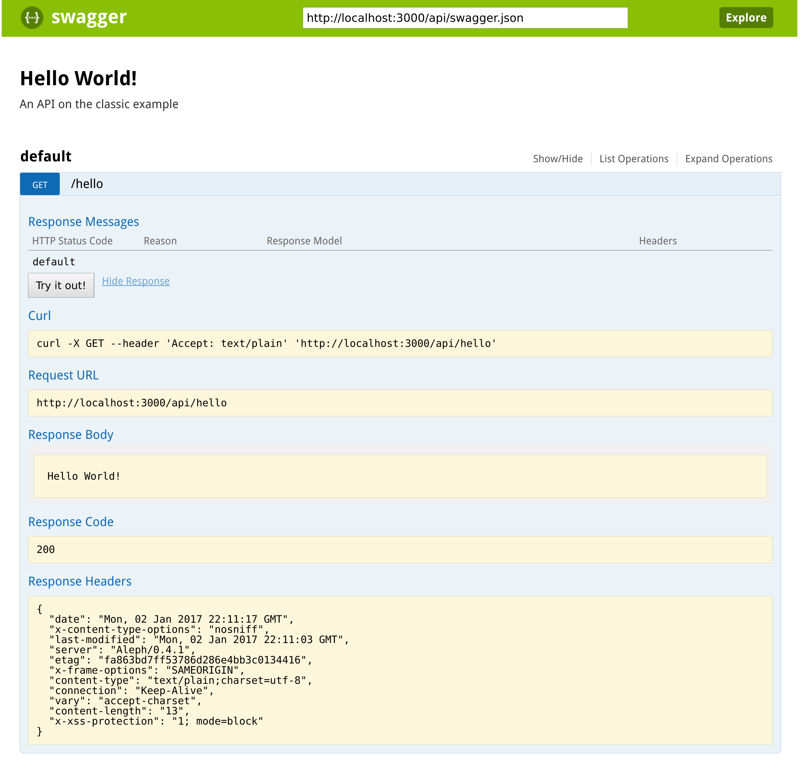

[[hello-world]]
= Hello World!

In this chapter we examine the "Hello World!" resource in depth. If you have followed the link:getting-started.html[Getting Started] chapter, you'll be up and running and ready to try the examples yourself, but it's not mandatory.

Let's look at the route definition in the file `src/edge/hello.clj` (the same one we saw in the Getting Started chapter).

[source]
----
(defn hello-routes [deps]
  ["/hello" (yada/handler "Hello World!\n")])
----

This function returns a *route structure*. The simplest route structure is a pair of elements contained in a vector. The first element is a path (or pattern) which matches on the URI's path when handling HTTP requests. The second element is often a handler function (but can be a sequence of further pairs).

In this route structure, any incoming request with a path of `/hello` gets send to the [yada]#yada# handler defined by `(yada/handler "Hello World!\n")`.

Let's focus on this handler. We could have used a standard Ring function `(fn [req] {...})` here but instead we created one with `yada/handler`, which takes a *resource* and turns it into a handler function.

A *resource* is a Clojure map (or more accurately, a Clojure record) that completely describes the methods, properties, representations, security and other miscellaneous properties of a web resource. The reason we can use a string (`Hello World`) here is because [yada]#yada# contains logic to _coerce_ a string into a resource. There are a number of built-in coercions from various Clojure types and of course you can provide your own.

== Examining the response

So we send a request which gets routed to our handler which creates a response. Let's examine this response in more detail, via `curl`. The `-i` option shows us the HTTP headers as well as the body.

[source,curl]
----
curl -i http://localhost:3000/hello
----

The response should be something like following (note that headers may appear in a different order):

[source,http]
----
HTTP/1.1 200 OK
Server: Aleph/0.4.1
Connection: Keep-Alive
Date: Fri, 17 Jun 2016 16:44:23 GMT
Last-Modified: Fri, 17 Jun 2016 16:43:02 GMT
ETag: fa863bd7ff53786d286e4bb3c0134416
Content-Type: text/plain;charset=utf-8
Vary: accept-charset
Content-Length: 23
X-Frame-Options: SAMEORIGIN
X-XSS-Protection: 1; mode=block
X-Content-Type-Options: nosniff
----

The first three response headers are added by our webserver, Aleph.

[source,http]
----
Server: Aleph/0.4.0
Connection: Keep-Alive
Date: Fri, 17 Jun 2016 16:44:23 GMT
----

Next we have another date and a string known as the _entity tag_:

[source,http]
----
Last-Modified: Sun, 09 Aug 2015 07:25:10 GMT
ETag: fa863bd7ff53786d286e4bb3c0134416
----

The `Last-Modified` header shows when the string `Hello World!` was created, which happens to be the last time the system was started (or reset). Java strings are immutable, so [yada]#yada# is able to deduce that the
string's creation date is also the last time it could have been modified.

The entity tag is computed from the value of the `Hello World!` itself. Unlike the `Last-Modified` value, it can survives a reset.

Both `Last-Modified` and `ETag` are used to support HTTP conditional requests and conflict detection when uploading new versions of a resource.

Next we have a header telling us the media-type of the string's
representation.

[source,http]
----
Content-Type: text/plain;charset=utf-8
----

yada is able to determine that the media-type is text, but without more
information it much default to `text/plain`. It can also tell us the charset, which defaults to the default charset of the JVM (almost always `utf-8`)

[source,http]
----
Vary: accept-charset
----

Since the Java platform can encode a string in other charsets, [yada]#yada# adds a _Vary_ header to signal to the user-agent (and proxy caches in between) that the body can change if a request contained a different _Accept-Charset_ header. Java installations support many different charsets, so [yada]#yada# does too.

Next we are given the length of the body.

[source,http]
----
Content-Length: 13
----

This value is in bytes, regardless of the charset. It includes the newline.

Finally we see our response body.

[source]
----
Hello World!
----

[[a-conditional-request]]
== A conditional request

In HTTP, a conditional request is one where a user-agent (like a browser) can ask a server for the state of the resource but only if a particular condition holds.

A common condition is whether the resource has been modified since a particular date, usually because the user-agent already has a copy of the resource's state which it can use if possible. If the resource hasn't been modified since this date, the server can tell the user-agent that there is no new version of the state.

We can test this by setting the *If-Modified-Since* header in the request.

Here's how we might do this using the curl command.

[source]
----
curl -i http://localhost:3000/hello -H "If-Modified-Since: Mon, 1 Jan 2525 00:00:00 GMT"
----

Of course, nobody will have modified the resource _since_ the year 2525, so we should get a 304 response, telling us we can use our cached copy:

[source]
----
HTTP/1.1 304 Not Modified
X-Frame-Options: SAMEORIGIN
X-XSS-Protection: 1; mode=block
X-Content-Type-Options: nosniff
Content-Length: 0
Vary: accept-charset
ETag: fa863bd7ff53786d286e4bb3c0134416
Server: Aleph/0.4.1
Connection: Keep-Alive
Date: Wed, 22 Jun 2016 16:57:46 GMT
----

Notice we also get the same `Vary` and `ETag` headers. These help any proxies between the user-agent and the service properly cache content, and if they would have been produced in a 200 response, then they must also be produced in a 304. (This is the kind of thing that [yada]#yada# takes care of for you, unlike most libraries).

[[content-negotiation]]
== Content negotiation

The responses we have received back from our service all contain this curious header called `Vary` set to `accept-charset`. The server is telling us (and any proxies between us) that the representation might vary depending on the charset negotiated. Let's see if we can get our "Hello World!" message returned in other charsets.

UTF-16 is a Unicode encoding where every character is encoded in 2 bytes. One reason we might want to use UTF-16 is if we need to know exactly how many bytes a string will take up.

Let's try getting the string in UTF16 by telling the server that's the only charset we'll accept:

[source]
----
curl -i http://localhost:3000/hello -H "Accept-Charset: UTF-16"
----

This returns the following:

[source]
----
HTTP/1.1 200 OK
X-Frame-Options: SAMEORIGIN
X-XSS-Protection: 1; mode=block
X-Content-Type-Options: nosniff
Content-Length: 28
Content-Type: text/plain;charset=utf-16
Last-Modified: Sun, 26 Jun 2016 11:11:31 GMT
Vary: accept-charset
ETag: 43b1f79e8efe0fa97c32901fbd5746d6
Server: Aleph/0.4.1
Connection: Keep-Alive
Date: Mon, 27 Jun 2016 07:45:07 GMT

��Hello World!
----

The "Hello World!" message is prepended with 2 bytes called the *Byte Order Mark* (BOM). The length of the string (including the newline) is 13 characters. Since each character is 2 bytes, that makes 26. The additional of the BOM makes it 28, which is what our `Content-Length` header reports.

A BOM indicates the order that the 2 bytes are transmitted in. In 'big endian' form the most-significant byte is transmitted first. We can tell the service that we only want the big endian form with the following:

[source]
----
curl -i http://localhost:3000/hello -H "Accept-Charset: UTF-16BE"
----

This will now produce the message without the BOM, because it is unnecessary. This means our `Content-Length` will be exactly 13 * 2 = 26.

[source]
----
HTTP/1.1 200 OK
…
Content-Length: 26

Hello World!
----

If we were to use UTF-32, which defaults to big-endian, we'll get a Content-Length of 13 * 4 = 52.

[source]
----
HTTP/1.1 200 OK
…
Content-Length: 52

Hello World!
----

Note also that different representations generate different `ETag` values. The entity tag is a way of managing a cache of representations, not a cache of resources. Think of the `ETag` value as the key you could use in a key/value store that stored a cache of representations.

The negotiation of charsets may be considered by some to be unnecessary given the dominance of UTF-8. That is certainly true for today's modern browsers. However, there are many other types of devices that are being connected to the internet (under the banner 'Internet of Things'). Many of these devices have very tight constraints on processing and memory which prevent them from supporting UTF-8. If we are building a web service, we may want to connect these devices to it in the future.

=== Languages

Of course it is not just charsets that can be negotiated. Another example is languages. Our "Hello World!" string is in English. Let's provide support for simplified Chinese.

This calls for a different implementation:

[source,clojure]
----
(defn hello-language []
  ["/hello-language"
   (yada/resource <1>
    {:methods
     {:get <2>
      {:produces
       {:media-type "text/plain"
        :language #{"en" "zh-ch;q=0.9"}} <3>
       :response
       #(case (yada/language %) <4>
          "zh-ch" "你好世界\n"
          "en" "Hello World!\n")}}})])
----

<1> Using the `yada/resource` function to create a custom resource
<2> The resource has a single method, GET
<3> English is preferred, but Simplified Chinese is available too
<4> This is a function that is given a *context* as the first argument. The `yada/language` convenience function pulls out the negotiated language from this context

Let's test this by providing a request header which indicates a preference for simplified Chinese:

[source]
----
curl -i http://localhost:3000/hello-language -H "Accept-Language: zh-CH"
----

We should get the following response:

[source,http]
----
HTTP/1.1 200 OK
X-Frame-Options: SAMEORIGIN
X-XSS-Protection: 1; mode=block
X-Content-Type-Options: nosniff
Content-Length: 13
Content-Type: text/plain
Content-Language: zh-ch
Vary: accept-language
Server: Aleph/0.4.1
Connection: Keep-Alive
Date: Mon, 27 Jun 2016 08:20:59 GMT

你好世界
----

There's a lot more to content negotiation than this simple example can show. It is covered in depth in subsequent chapters.

[[mutation]]
== Mutation

Let's try to overwrite the string by using a `PUT`.

[source]
----
curl -i http://localhost:3000/hello -X PUT -d "Hello Wonderful World!%0a"
----

The response is as follows:

[source]
----
HTTP/1.1 405 Method Not Allowed
Allow: GET, HEAD, OPTIONS
Content-Length: 284
Content-Type: application/json
Server: Aleph/0.4.1
Connection: Keep-Alive
Date: Mon, 27 Jun 2016 08:56:58 GMT
----

The response status is `405 Method Not Allowed`, telling us that our request was unacceptable. There is also an *Allow* header, telling us which methods are allowed. One of these methods is OPTIONS, which we could have used to check whether PUT was available without actually attempting it.

[source]
----
curl -i http://localhost:3000/hello -X OPTIONS
----

The response should be:

[source]
----
HTTP/1.1 200 OK
Allow: GET, HEAD, OPTIONS
Content-Length: 0
X-Frame-Options: SAMEORIGIN
X-XSS-Protection: 1; mode=block
X-Content-Type-Options: nosniff
Server: Aleph/0.4.1
Connection: Keep-Alive
Date: Mon, 27 Jun 2016 09:00:27 GMT
----

Both the `PUT` and the `OPTIONS` response contain an *Allow* header which tells us that `PUT` isn't possible. This makes sense, because we can't mutate a Java string.

We could, however, wrap the Java string in a Clojure atom which could reference different Java strings at different times.

To demonstrate this, try the following with the identifier `http://localhost:3000/hello-atom`.

[source,clojure]
----
(yada/handler (atom "Hello World!\n"))
----

Let's try a normal GET.

[source]
----
curl -i http://localhost:3000/hello-atom -X OPTIONS
----

We can now make another `OPTIONS` request to see whether `PUT` is available, before trying it.

[source]
----
curl -i http://localhost:3000/hello-atom -X OPTIONS
----

[source]
----
HTTP/1.1 200 OK
Allow: GET, DELETE, HEAD, OPTIONS, PUT
Content-Length: 0
X-Frame-Options: SAMEORIGIN
X-XSS-Protection: 1; mode=block
X-Content-Type-Options: nosniff
Server: Aleph/0.4.1
Connection: Keep-Alive
Date: Tue, 05 Jul 2016 15:41:36 GMT
----

It is! So let's try it.

[source]
----
curl -i http://localhost:3000/hello-atom -X PUT -d "value=Hello Wonderful World!%0a"
----

And now let's see if we've managed to change the state of the resource.

[source]
----
curl -i http://localhost:3000/hello-atom
----

[source,http]
----
HTTP/1.1 200 OK
X-Frame-Options: SAMEORIGIN
X-XSS-Protection: 1; mode=block
X-Content-Type-Options: nosniff
Content-Length: 23
Content-Type: text/plain;charset=utf-8
Last-Modified: Tue, 05 Jul 2016 16:08:22 GMT
Vary: accept-charset
ETag: 3c3e0684be182b7185f6ad10b63f246a
Server: Aleph/0.4.1
Connection: Keep-Alive
Date: Tue, 05 Jul 2016 16:08:35 GMT

Hello Wonderful World!
----

As long as someone else hasn't sneaked in a different state between your `PUT` and subsequent `GET`, you should see the new state of the resource is "Hello Wonderful World!". Great!

But what if someone _did_ manage to `PUT` their change ahead of yours? Their version would now be overwritten. That might not be what you wanted. To ensure we don't override someone's change, we could have set the *If-Match* header using the *ETag* value.

Let's test this now, using the ETag value we got before we sent our `PUT` request.

[source]
----
curl -i http://localhost:3000/hello-atom -X PUT -H "If-Match: fa863bd7ff53786d286e4bb3c0134416" -d "value=Hello Wonderful World!%0a"
----

[source]
----
HTTP/1.1 412 Precondition Failed
Content-Length: 196
Content-Type: application/json
Server: Aleph/0.4.1
Connection: Keep-Alive
Date: Tue, 05 Jul 2016 16:10:53 GMT
----

We get a 412, which means a pre-condition failed. The pre-condition in question relates to our `If-Match` header value not matching the current value of the atom. This is a very useful result, because it means we can ensure that we don't overwrite someone else's data.

[[a-head-request]]
== A HEAD request

There was one more method indicated by the *Allow* header of our `OPTIONS` request, which was `HEAD`. Let's try this now.

[source]
----
curl -i http://localhost:3000/hello -X HEAD
----

[source,http]
----
----

The response does not have a body, but tells us the headers we would get if we were to try a `GET` request.

[[parameters]]
== Parameters

Often, a resource's state or behavior will depend on parameters in the
request. Let's say we want to pass a parameter to the resource, via a
query parameter.

To show this, we'll write some real code:

[source,clojure]
----
(require '[yada.yada :refer [yada resource]])

(defn say-hello [ctx]
  (str "Hello " (get-in ctx [:parameters :query :p]) "!\n"))

(def hello-parameters-resource
  (resource
    {:methods
      {:get
        {:parameters {:query {:p String}}
         :produces "text/plain"
         :response say-hello}}}))

(def handler (yada/handler hello-parameters-resource))
----

This declares a resource with a GET method, which responds with a plain-text message formed from the query parameter.

Let's see this in action, but without a parameter:

[source]
----
curl -i http://localhost:3000/hello-parameter
----

Here we get a 400 response. This means we've done something wrong (we've forgotten to add the query parameter).

Now let's add the query parameter to the URI:

[source]
----
curl -i http://localhost:3000/hello-parameter?p=Ken
----

This should now get the 200 response we wanted:

[source,http]
----
HTTP/1.1 200 OK
X-Frame-Options: SAMEORIGIN
X-XSS-Protection: 1; mode=block
X-Content-Type-Options: nosniff
Content-Length: 11
Content-Type: text/plain
Server: Aleph/0.4.1
Connection: Keep-Alive
Date: Tue, 05 Jul 2016 16:23:26 GMT

Hello Ken!
----

Great!

As well as query parameters, yada supports path parameters, request headers, form data, cookies and request bodies. You can have optional parameters, in fact, anything that can be expressed in Plumatic Schema, and [yada]#yada# will even coerce parameters to a range of types. For more details, see the link:parameters.html[Parameters] chapter.

[[hello-swagger]]
== Hello Swagger!

Now we have seen how to build a single web resource, let's see how to build a Swagger description from a collection of web resources.

In your editor, switch to `src/edge/server.clj`. This file defines the overall route structure which includes our routes for "Hello World!". This has been included twice, both at the root and under the `/api` path.

This second version uses the Clojure threading macro `->` which wraps the route structure with `yada/swaggered` and gives it a bidi tag (used for generating URIs, we'll use this later).

[source,clojure]
----
[
    ;; Hello World!
    (hello-routes {})

    ["/api" (-> (hello-routes {})
                ;; Wrap this route structure in a Swagger
                ;; wrapper. This introspects the data model and
                ;; provides a swagger.json file, used by Swagger UI
                ;; and other tools.
                (yada/swaggered
                 {:info {:title "Edge API"
                         :version "1.0"
                         :description "An example API"}
                  :basePath "/api"})
                ;; Tag it so we can create an href to this API
                (tag :edge.resources/api))]]
----

The purpose of `yada/swaggered` is to augment the route structure given to it with a route to `swagger.json`, which responds with a Swagger description of the route structure in JSON. Since [yada]#yada# resources are data maps, this is a relatively simple data transformation of the route structure.

We can test the resource is available at its `/api` location with this `curl` command:

[source,curl]
----
curl -i http://localhost:3000/api/hello
----

We can also query the Swagger description with this `curl` command:

[source,curl]
----
curl -i http://localhost:3000/api/swagger.json
----

This time we get a JSON body returned:

[source]
----
HTTP/1.1 200 OK
X-Frame-Options: SAMEORIGIN
X-XSS-Protection: 1; mode=block
X-Content-Type-Options: nosniff
Content-Length: 290
Content-Type: application/json
Last-Modified: Wed, 22 Jun 2016 15:45:16 GMT
Vary: accept-charset
ETag: 7833a69510d2b80f2a414c3c4ef2b4d4
Server: Aleph/0.4.1
Connection: Keep-Alive
Date: Wed, 22 Jun 2016 15:56:25 GMT

{"swagger":"2.0","info":{"title":"Edge API","version":"1.0","description":"An example API"},"produces":["application/json"],"consumes":["application/json"],"paths":{"/hello":{"get":{"produces":["text/plain"],"responses":{"default":{"description":""}}}}},"basePath":"/api","definitions":{}}
----

Notice we still get a `Vary` header telling us that multiple charsets are available. JSON bodies are available in UTF-16 and UTF-32. Compare this with Clojure's EDN, which is specificed to be UTF-8 only. In fact, [yada]#yada# is happy to produce Swagger definitions in EDN too:

[source,curl]
----
curl -i http://localhost:3000/api/swagger.edn
----

Note that this time we get no `Vary` header, since there are no charset alternatives.

[source]
----
HTTP/1.1 200 OK
X-Frame-Options: SAMEORIGIN
X-XSS-Protection: 1; mode=block
X-Content-Type-Options: nosniff
Content-Length: 284
Content-Type: application/edn
Last-Modified: Wed, 22 Jun 2016 15:45:16 GMT
ETag: 3aa57341aa88d68108dbead14f5b462c
Server: Aleph/0.4.1
Connection: Keep-Alive
Date: Wed, 22 Jun 2016 15:59:26 GMT

{:swagger "2.0", :info {:title "Edge API", :version "1.0", :description "An example API"}, :produces ["application/json"], :consumes ["application/json"], :paths {"/hello" {:get {:produces ("text/plain"), :responses {:default {:description ""}}}}}, :basePath "/api", :definitions {}}
----

It's these little details that [yada]#yada# takes care of for you. There is no trickery involved, it's simply the result of an almost obsessive focus on the relevant web standards. There is nothing special about strings, [yada]#yada# applies the same logic for anything else you ask it to handle. We'll see more in the next chapter.

By the way, if you want to see the Swagger UI, browse to http://localhost:3000/swagger/?url=http://localhost:3000/api/swagger.json

[[summary]]
== Summary

This has been a long chapter, but we have only covered a simple "Hello World!" example.

You should now realise that implementing even a basic example that properly complies with the HTTP standard is a surprisingly tough undertaking. But this simple example demonstrated how a rich and functional HTTP resource can be created with a tiny amount of code, and none of the behaviour we have seen is hardcoded or contrived. We have only demonstrated a simple Java string, and [yada]#yada# includes similar support for many other basic types (atoms, Clojure collections, files, directories, Java resources…).

But the best thing is you can programmatically create your own resources and types to fit your particular requirements.

Without a library like [yada]#yada# we would need to read and understand hundreds of pages of the HTTP RFCs and spend a great deal of extra effort coding up its various aspects. Of course, nobody would bother doing that, but the consequence is that we miss out on the many architectural benefits of HTTP.

Rarely can client code make any assumptions that the HTTP API it is accessing complies with the text in the HTTP RFCs, and must therefore rely on detailed knowledge of how the API is written, either through documentation, Swagger definitions, close collaboration between development teams or some other means (trial-and-error). This is a problem because it causes rigidity between our systems.

By using [yada]#yada#, we are pushing the responsibility of implementing HTTP correctly away from the programmer and into a library.
